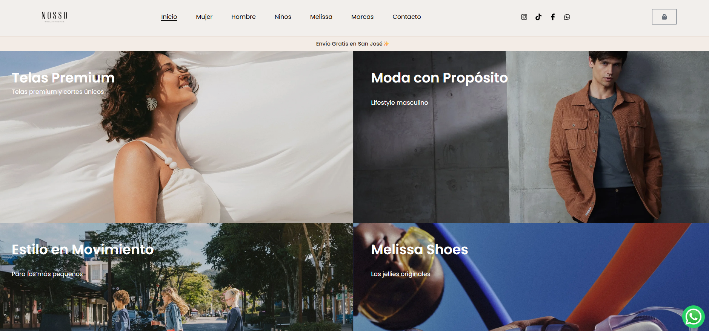

# NossoCR WordPress and WooCommerce

Public portfolio repository for the NossoCR storefront project in Costa Rica.

## Project overview

As Lead Developer, Nicolás Cartín Reyes developed the storefront from scratch using Elementor for page building, WordPress theme selection and customization, and custom PHP, HTML, and CSS. The experience brings product catalogs, promotions, WhatsApp commerce, search visibility, and visual merchandising together for a Costa Rican multi-brand fashion retailer.

## Storefront preview

## Project focus

- WordPress and WooCommerce storefront management
- Product catalog and merchandising
- Promotions and customer-facing content
- WhatsApp commerce and customer contact paths
- Search engine optimization

## Project lead

Nicolás Cartín Reyes, Lead Developer

## Public portfolio

- Portfolio: https://nikocartin.github.io/
- GitHub profile: https://github.com/NikoCartin

## Curated source

The reviewed export contained a small set of site-specific customizations saved in WordPress. Sanitized excerpts are in [`custom-code/`](custom-code/): one active PHP snippet, two Customizer CSS entries, and two Elementor HTML widgets with the live WhatsApp number replaced by `WHATSAPP_NUMBER`. No custom JavaScript or standalone custom theme/plugin source was identified in the reviewed files.

## Security and data handling

The full hosting archive and database are not included. Production configuration, customer or order data, logs, private media, WordPress core, and third-party themes or plugins are excluded. Review and sanitize any future contribution before public release.
